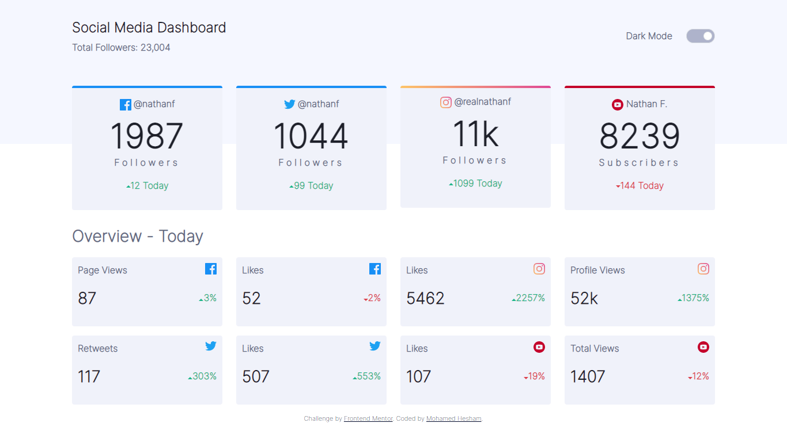

# Frontend Mentor - Social media dashboard with theme switcher solution

## Overview
### The challenge

Users should be able to:

- View the optimal layout for the site depending on their device's screen size
- See hover states for all interactive elements on the page
- Toggle color theme to their preference

### Screenshot

### Links

- Solution URL: ()
- Live Site URL: ()
### Built with

- HTML
- CSS custom properties
- bootstrap4
- Mobile-first workflow
- javascript
## Author

- Frontend Mentor - [@yourusername](https://www.frontendmentor.io/profile/yourusername)
- Linkedin - [@yourusername]()
